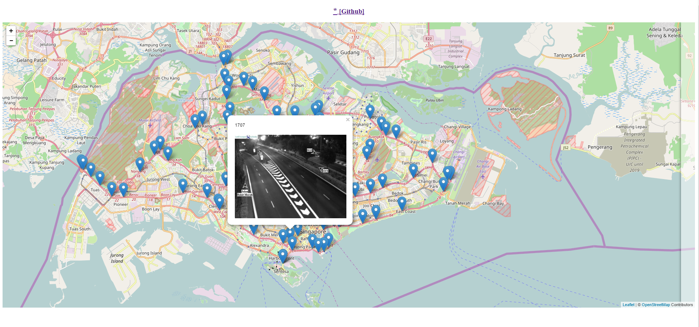
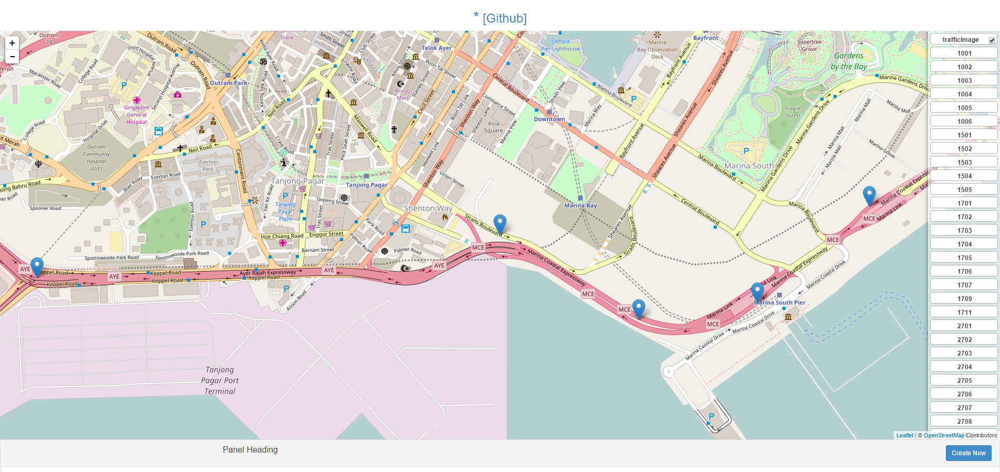
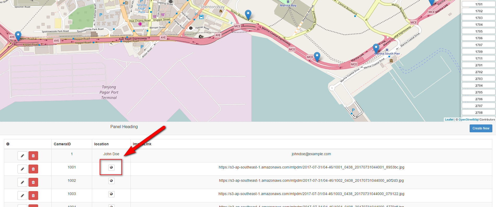

# Ryde project 

Step 1 :  npm install

Step 2 : change accountkey
please change accountkey by your accountkey
`````
var options = {
    host:'datamall2.mytransport.sg',
    path:'/ltaodataservice/Traffic-Images',
     headers: {
    'accept': 'application/json',
    'AccountKey': 'AccountKey'
  }
}

`````

Step3 : change mongodb connectionstring in config.js

`````
if(env === 'development'){
    process.env.PORT = 3000;
    process.env.MONGODB_URI = 'mongodb://localhost:27017/Ryde';
} else if (env === 'test') {
    process.env.PORT = 3000;
    process.env.MONGODB_URI = 'mongodb://localhost:27017/RydeTest';
}
`````
Step4 : if you don't want to wait for 5 minutes, you can change rule.minute to rule.second.

5 minutes : rule.minute = new schedule.Range(0, 59, 5);
5 second : rule.second = new schedule.Range(0, 59, 5);

Step5 : node server/server.js

Step6 : open localhost:3000 in browser


When click marker, image will show up



when click lable on bar, map will move to location and change color of marker to red


When click location icon, map will move to location

